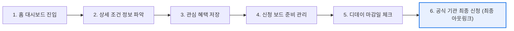
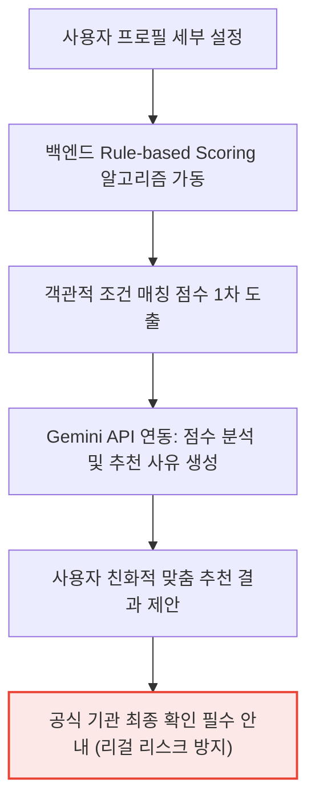

# 📱 챙김 랜딩사이트

정부 혜택 탐색과 신청 준비 과정을 소개하는 모바일 PWA 프로젝트, **챙김**의 랜딩사이트입니다.

챙김 랜딩사이트는 단순 기술 설명형 포트폴리오가 아닌, **실제 앱 화면 캡쳐를 중심으로 서비스 가치, 사용자 흐름, AI 추천 설계 원칙, 기술 구조, UX 개선 내용**을 체계적으로 시각화하여 보여주는 프로덕트형 케이스스터디 페이지입니다.

> [!CAUTION]
> **챙김**은 실제 대상 여부나 신청 가능 여부를 공식적으로 보장하지 않습니다.  
> 모든 최종 확인과 신청은 반드시 **공식 기관 사이트**에서 진행해야 합니다.

<br />

## 🔗 Links

| 구분 | 링크 |
| --- | --- |
| **Landing Demo** | 🖥️ 준비 중 |
| **App Demo** | 🔗 [chaengim.vercel.app](https://chaengim.vercel.app/) |
| **GitHub** | 🐙 [github.com/rhazns22](https://github.com/rhazns22) |
| **Portfolio** | 💼 [pjewep.vercel.app](https://pjewep.vercel.app/) |
| **Email** | ✉️ pje698112@naver.com |

<br />

## 🖼️ Preview

배포 후 랜딩사이트 대표 이미지가 이곳에 추가될 예정입니다.

```md

```

<br />

## 📌 프로젝트 개요

챙김은 나에게 맞는 정부 혜택을 찾고, 관심 혜택의 신청 준비 상태와 마감 일정을 한 곳에서 관리하는 **모바일 앱형 PWA**를 목표로 한 프로젝트입니다.

이 랜딩사이트는 챙김 앱의 기획 의도와 실제 구현 결과를 포트폴리오 관점에서 설명하기 위해 제작했습니다.

### 🎯 주요 전달 메시지
* 🔍 **문제 해결**: 정부 혜택 정보가 여러 기관 사이트에 흩어져 있어 사용자가 직접 조건과 마감일을 하나하나 확인해야 하는 불편함을 해결합니다.
* 🗺️ **사용자 여정**: 홈, 혜택 상세, 프로필 설정, 맞춤 추천, 신청 보드, 신청 일정으로 유연하게 이어지는 사용자 경험을 제안합니다.
* 🤖 **보조적 AI**: AI가 최종 대상 여부를 단정 짓지 않고, 추천 점수와 이유를 설명하는 보조 도구로만 동작하도록 제한 설계했습니다.
* 📸 **실제 앱 기반 쇼케이스**: 모형 화면이 아닌 실제 동작하는 PWA의 캡쳐본을 바탕으로 신뢰성 높은 결과물을 보여줍니다.
* ⚡ **모던 기술 스택**: React, TypeScript, Tailwind CSS, Framer Motion을 활용하여 완성도 높은 반응형 인터랙션을 구현했습니다.

---

## 🛠️ 1. 기술 아키텍처 및 개발 환경

### 🛡️ Tech Badges
<div>
  
  
  
  
  
  
  
  
  
</div>

<br />

### 🏗️ 기술 아키텍처 (Tech Architecture)

챙김 PWA 및 랜딩사이트의 전반적인 기술 구조와 데이터 흐름을 도식화한 아키텍처입니다.

```mermaid
graph TD
    subgraph Frontend [Client Side]
        A[React & TypeScript] --> B[Zustand State Store]
        A --> C[Tailwind CSS & Framer Motion]
    end

    subgraph Backend [Server Side]
        D[Express API Server] --> E[JWT Auth Middleware]
        E --> F[Business Logic Services]
    end

    subgraph Database [Persistence Layer]
        G[Prisma ORM] --> H[(MySQL Database)]
    end

    subgraph External [External APIs]
        I[Gemini API - AI Recommendation]
        J[GOV24 Public Data API]
    end

    B -- Axios HTTPS Request -- > D
    F --> G
    F --> I
    F --> J

    style Frontend fill:#e8f0fe,stroke:#4285f4,stroke-width:2px
    style Backend fill:#fef7e0,stroke:#f4b400,stroke-width:2px
    style Database fill:#e6f4ea,stroke:#34a853,stroke-width:2px
    style External fill:#fce8e6,stroke:#ea4335,stroke-width:2px
```

<br />

### 📁 폴더 구조 (Folder Structure)

현재 랜딩사이트의 주요 구현은 `src/App.tsx`에 통합되어 있으며, 스케일업 시 컴포넌트 단위 분리가 용이하도록 설계되어 있습니다.

```txt
src/
  ├── App.tsx             # 메인 앱 엔트리 및 랜딩 레이아웃 구현
  ├── App.css             # 글로벌 컴포넌트 커스텀 스타일
  ├── index.css           # Tailwind CSS 디렉티브 및 베이스 스타일
  ├── main.tsx            # 리액트 마운트 스크립트
  └── assets/             # 정적 리소스 폴더
        └── images/
              ├── app_icon.png
              ├── hero_banner.png
              └── screens/     # 실제 PWA 동작 캡쳐 화면
                    ├── home.png
                    ├── detail.png
                    ├── profile.png
                    ├── recommend.png
                    ├── board.png
                    └── schedule.png
```

> [!TIP]
> 향후 비즈니스 로직 확장 시 다음과 같이 컴포넌트와 상수를 관심사 기반으로 리팩토링할 예정입니다.
> * `src/components/`: `AppMockup.tsx`, `CountUpNumber.tsx`, `ScreensShowcase.tsx` 등 컴포넌트 모듈화
> * `src/constants/`: `motion.ts` (Framer motion 옵션), `appScreens.ts` (쇼케이스 화면 메타데이터) 분리

<br />

### ⚙️ 실행 및 검증 방법

#### 1) 사전 준비
* **Node.js**: `v20` 이상 권장
* **npm**: 패키지 관리 도구

#### 2) 설치 및 개발 서버 구동
```bash
# 의존성 패키지 설치
npm install

# 로컬 개발 서버 실행 (기본 포트: http://localhost:5173)
npm run dev
```

#### 3) 프로덕션 빌드 및 린트 검증
```bash
# 코드 정적 분석 및 포맷 확인
npm run lint

# 프로덕션 빌드 파일 생성
npm run build
```

> [!NOTE]
> 최근 실행 결과 `npm run lint` 및 `npm run build` 모두 에러 없이 정상 통과됨을 확인했습니다.

---

## 📢 2. 서비스 주요 기능 및 화면 구성

### 1️⃣ Hero Section
첫 화면에서는 대형 카피와 홈 화면 iPhone 목업을 활용하여 챙김의 핵심 가치를 가장 먼저 명확하게 각인시킵니다.
* **주요 구성**: 서비스 핵심 카피, 홈 화면 3D floating 목업, 통계 수치 요약(추천/마감/신청 건수), CTA 버튼 및 기술 스택 배지
* **핵심 카피**:
  ```txt
  놓치기 쉬운 정부 혜택,
  이제 챙김이 정리해드릴게요.
  ```

### 2️⃣ 한눈에 보는 챙김
챙김이 사용자에게 제공하는 3대 핵심 가치를 카드 UI로 일목요연하게 전달합니다.

| 기능 | 설명 |
| :--- | :--- |
| **🔍 혜택 찾기** | 여러 곳에 분산된 정부 혜택을 다양한 카테고리와 강력한 검색 필터로 빠르고 간편하게 탐색합니다. |
| **📋 신청 준비** | 나에게 꼭 필요한 혜택을 나만의 신청 보드에 보관하고, 맞춤형 체크리스트로 누락 없이 준비합니다. |
| **📅 일정 관리** | 마감기한이 정해진 중요 혜택들을 디데이(D-Day) 기준으로 일목요연하게 정렬하여 마감을 방지합니다. |

### 3️⃣ WHY (기획 의도)
기존 정부 혜택 수혜 과정에서 사용자가 직접 부딪히는 실질적 문제점들을 나열합니다.
* 흩어져 있어 찾아다녀야 하는 혜택 정보
* 어렵고 모호한 신청 자격 조건 판단
* 저장 후에도 체계적으로 관리되지 않는 준비 서류/마감 현황
* AI가 판단한 내용이 최종 법적 자격인 것처럼 사용자에게 오해를 불러일으킬 수 있는 설계 리스크

### 4️⃣ Sticky Feature Showcase
데스크톱 브라우저 환경에서는 우측의 **iPhone 목업 프레임이 화면 스크롤 시 Sticky하게 고정**되며, 좌측 텍스트 내용의 변화에 맞추어 실시간으로 화면 이미지가 페이드인/아웃 전환됩니다. (모바일 기기에서는 각 문단 아래에 이미지가 일렬로 정렬되어 최적화된 반응형 모바일을 구현합니다.)

### 5️⃣ Screens Showcase & 실제 캡쳐 데이터
사용자 여정에 따라 구성된 핵심 6개의 화면을 클릭 카드를 통해 전환하며 직접 탐색할 수 있습니다.

| 라벨 | 화면명 | 설명 |
| :---: | :--- | :--- |
| **A** | 🏠 홈 대시보드 | 맞춤형 추천 혜택, 긴급 마감 혜택, 신청 보드 진행 상태를 카드형 대시보드로 요약 제공 |
| **B** | 📄 혜택 상세 보기 | 공공데이터 원문의 긴 텍스트를 질문/답변형 구조로 시각화하여 한눈에 알아보기 쉽게 재정리 |
| **C** | 👤 프로필 맞춤 설정 | 연령, 가구 소득, 관심사 등 추천 매칭에 필요한 핵심 항목만 입력받는 깔끔한 프로필 폼 |
| **D** | 🤖 AI 맞춤 추천 | 입력 정보 기반의 조건 매칭 점수와 AI가 분석한 객관적인 맞춤형 추천 근거 제시 |
| **E** | 📋 신청 관리 보드 | 혜택별로 챙겨야 할 구비 서류 체크리스트 제공 및 준비 상태(준비 중, 완료 등) 관리 |
| **F** | 📅 신청 마감 일정 | 저장한 혜택들의 마감 일정을 달력 및 디데이(D-Day) 카드 리스트로 자동 변환 |

> [!IMPORTANT]
> **Screens Showcase**는 디자이너의 시안이나 임의 렌더링 화면이 아닌, 실제 구동되는 **챙김 PWA에서 캡쳐한 순수 캡쳐본 이미지**(`src/assets/images/screens/`)를 활용하여 포트폴리오의 실뢰도를 높였습니다.

### 6️⃣ User Journey & AI Principle

사용자가 혜택을 찾고 최종 신청하기까지의 논리적인 단계와, AI 추천이 사용자 안전을 보장하는 단계를 시각적으로 처리한 흐름입니다.

#### 🚶‍♂️ 사용자 여정 흐름 (User Journey)


#### 🧠 AI 추천 설계 원칙 (AI Recommendation Principle)


* **핵심 설계 원칙**:
  ```txt
  AI는 독단적인 판단자가 아닙니다.
  사용자의 정보 탐색을 돕는 '설명 도구'로서 정해진 가이드라인 내에서 동작합니다.
  ```

---

## ⚡ 3. 핵심 구현 및 인터랙션 기술

### 💡 주요 기술적 특징

* **실제 앱 기반 Showcase 연동**:
  - 실제 챙김 PWA의 스크린샷 데이터를 활용하여 포트폴리오 검토자가 랜딩에서 앱의 실제 UI/UX 퀄리티를 미리 검증할 수 있습니다.
* **Scroll-Sticky Showcase**:
  - 데스크톱 뷰포트에서 스크롤 트리거에 따라 우측 iPhone mockup 프레임이 자연스럽게 화면에 머무르며 최적의 몰입감을 제공합니다.
* **Screens Showcase 탭 전환**:
  - A~F 버튼 클릭 시 `aria-selected` 웹 접근성 속성을 제어하며 Framer Motion의 부드러운 fade transition으로 Mockup의 디스플레이를 교체합니다.
* **Count-up Number 모션**:
  - 데이터 통계 수치에 카운트업 애니메이션을 적용해 생동감을 더했으며, `prefers-reduced-motion` 미디어 쿼리를 감지해 모션 민감 사용자에게는 즉시 최종 수치를 렌더링하도록 예외 처리했습니다.
* **AI의 책임 한계 분리**:
  - 리걸 이슈를 방지하고자 Rule-based 알고리즘으로 대상을 1차 필터링하고 AI는 개인화 설명 보조에만 활용하는 2단계 아키텍처를 도입했습니다.

### 🎭 적용한 인터랙션 리스트
* Hero 텍스트 및 UI 요소 순차적 Fade-up 효과
* iPhone 3D Mockup의 부드러운 Floating(둥둥 떠 있는) 모션
* 스크롤 진행에 맞춘 섹션별 Scroll Reveal 페이드인 효과
* 카드 정보 요소의 순차적 Stagger Reveal 효과
* 버튼 Hover/Tap 시의 마이크로 스케일 인터랙션
* CSS 미디어 쿼리를 통한 모션 저감화(`prefers-reduced-motion`) 환경 지원

### ♿ 접근성 및 편의성 대응
* 화면 선택 카드에는 시각장애인 스크린 리더 인식을 위해 `button` 시맨틱 태그 및 `aria-selected` 속성을 명시적으로 할당했습니다.
* 키보드 탭 키 이동(Tab focus navigation) 시 포커스 링(`focus-visible`)을 또렷하게 표시하여 시각적 피드백을 강화했습니다.
* 모바일 환경에서는 의도하지 않은 스크롤 튀김을 방지하기 위해 Sticky 요소 및 시각적으로 과한 Parallax 모션을 제거했습니다.

---

## 📊 4. 프로젝트 회고 및 분석

### 📝 구현 시 고려한 점

* **사용자 가치 우선 레이아웃 기획**:
  - 개발자가 빠지기 쉬운 "기술 소개 위주의 서술"을 탈피하고, 일반 사용자나 기획자의 입장에서 "이 서비스가 어떤 문제를 어떻게 쉽게 풀어냈는지"의 가치를 우선으로 배치했습니다.
* **신뢰감을 주는 브랜드 컬러 아이덴티티**:
  - 공공 성격의 정보를 담는 신뢰도 높은 인상을 형성하기 위해, Chaengim Blue (`#5B78F0`) 및 백그라운드 그레이, 대비율을 충족하는 블랙 계열 텍스트를 중심으로 디자인 시스템을 일원화했습니다.
  
  | 역할 | 컬러명 | HEX |
  | :--- | :--- | :--- |
  | **Primary** | Chaengim Blue | `#5B78F0` |
  | **Background** | App Background | `#F6F7FB` |
  | **Surface** | Card White | `#FFFFFF` |
  | **Text Main** | Text Primary | `#2F3441` |
  | **Text Sub** | Text Secondary | `#8B909E` |
  | **Border** | Base Border | `#ECEEF5` |

### 🚀 한계 및 개선 방향
* 향후 배포 사이트 및 오픈소스 상세 링크가 확정되는 대로 링크 정보를 최신화할 예정입니다.
* 대규모 데이터 및 공공 데이터 API의 비정상 동작을 다루는 예외 처리(Fallback UX)를 고도화할 계획입니다.
* 설치 프로모트 배너 커스터마이징, Service Worker 캐싱 전략 등의 PWA 고도화 기술 요소를 추가하는 섹션을 확장하여 작성할 예정입니다.

### 💼 포트폴리오 전달 흐름 (Read Path)
본 리드미와 랜딩페이지는 검토자가 아래의 최적 흐름대로 프로젝트의 전반을 쉽고 빠르게 파악하도록 구성했습니다.

```txt
기술 아키텍처 & 스택
  ↓
문제 정의 (WHY)
  ↓
서비스 가치 제안
  ↓
실제 앱 화면 & 쇼케이스
  ↓
사용자 여정
  ↓
AI 추천 설계 원칙
  ↓
UX 개선 히스토리
  ↓
디자인 시스템
```

> 💡 **핵심 슬로건**  
> "챙김은 정부 혜택을 단순히 나열하는 웹이 아니라, 사용자가 자신에게 맞는 혜택을 능동적으로 찾고 마감일까지 누수 없이 보관/관리하도록 설계한 개인 밀착형 PWA 프로젝트입니다."
